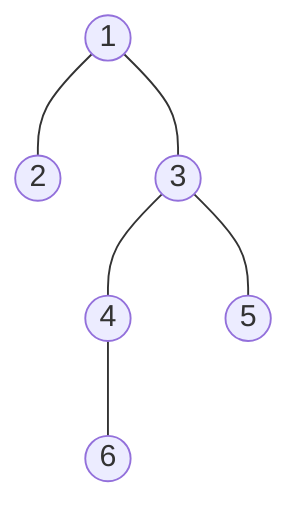

在[图论](https://zh.wikipedia.org/wiki/图论)和[计算机科学](https://zh.wikipedia.org/wiki/计算机科学)中，**最近公共祖先**（英语：lowest common ancestor）是指在一个[树](https://zh.wikipedia.org/wiki/树_(图论))或者[有向无环图](https://zh.wikipedia.org/wiki/有向无环图)中同时拥有*v*和*w*作为后代的最深的节点。

<!--more-->

## 朴素求LCA

### 思想及参考代码



假如在这样一棵树上， 我们需要找到`6`和`2`的LCA， 如何找到一个普适的流程呢。

1. 初始化得到每一个结点的父结点编号， 以及深度
2. 将要求的两个结点较深的一个不断上移， 直到两个结点深度相同
3. 将两个结点同时一步一步地上移， 直到两个结点相遇， 此时所在结点即为LCA

```cpp
int dep[N], fa[N];

int lca(int a, int b) {
  if (dep[a] < dep[b]) swap(a, b);
  while (dep[a] > dep[b]) a = fa[a];
  while (a != b) a = fa[a], b = fa[b];
  return a;
}
```

### 时间复杂度分析

预处理中， 只需要遍历一遍树， 时间复杂度为$O(n)$

求lca过程中， 考虑树构成一条链的极端情况， 此时时间复杂度为$O(n)$, 在查询次数多时显然是无法让人接受的。

## 倍增求LCA

### 思想

上面朴素做法最大的问题是每次只移动一步， 当要移动的总步数很大时， 效率就很低。

因此， 能不能一次移动多步呢？


我们先来声明一下， 在树中， 每个结点可能有多个祖先， 如6的祖先有`4、3、1`. 我们按顺序称4是6的第一个祖先， 3是6的第二祖先， 以此类推。

众所周知， 任何一个正整数x转化为二进制， 都可以表示为若干唯一的2的不同幂次的和， 如$10 = 2^3 + 2^1, 13 = 2^3 + 2^2 + 2^0$.

假设从结果上看， a要向上移动10次， 我们可以让其移动到它第八个祖先， 再移动到当前结点的第二个祖先， 这样就只移动了两次。

但上述的前提是， 你需要记录每个结点的第$2^x, x=0, 1, 2...$个祖先是谁。

我们定义$f[i][j]$为， `i`号结点的第$2^j$个祖先， 先假设已经求出了这个数组。

同样的， 定义$dep[i]$为`i`号结点的深度。

此时来考虑， 有了这些信息， 我们怎么求出两个结点的lca。

---

上面的暴力算法的第一步是， 将深度较大的结点上移至另一个结点的高度。

我们假设a是深度较深的， b是深度较浅的。

要跳的步数是a-b， 从二进制的角度分析我们可以知道， 最少的跳数， 就是a-b转化为2进制后1的个数， 且每种幂次只需要跳一次。

因此我们从一个上限m($2^m$大于树的最大深度)开始向下枚举， 若a向上跳$2^i$步后， 深度不会小于b， 那就往上跳；最终可以快速的到达与b相同的深度。

再来考虑， 深度相同后， 怎么快速的找到两个结点的最近公共祖先。

此时策略就有所不同了。


以上图距离， 假设要做4和5的lca， 也就是3， 但3的祖先也都是4和5的公共祖先， 因此如果跳到3及3以上的位置， 我们是不能判断这个结点是不是最近的公共祖先的。

因此我们改变策略， 让此时已经同深度的a和b， 跳到它们的最近公共祖先的下一层， 因此我们就有明确的判断条件即两个结点跳了之后不能相同。

倍增的思路基本就是这些了， 实现一下代码试试。

```cpp
int lca(int a, int b) {
  if (dep[a] < dep[b]) swap(a, b);
  //跳至相同深度
  for (int i = MAX; i >= 0; i --) {
    if (dep[f[a][i]] >= dep[b]) a = f[a][i];
    if (a == b) return a;//如果b是a的祖先， 那么最终a会直接跳到b的位置
  }
  //同时往上跳
  for (int i = MAX; i >= 0; i --) {
    if (f[a][i] != f[b][i]) a = f[a][i], b = f[b][i];
  }
  //当前结点的父结点即为a和b的lca
  return f[a][0];
}
```

---

回头来考虑怎么初始化那些需要的信息。

深度dep就不用说了。

而倍增祖先数组`f`， 则要用到一个递推的性质。

假设`u`的所有祖先的`f`信息我们都已经得到， 且已知了u的父结点(f\[x][0])， 那么有递推式$f[u][i] = f[f[u][i - 1]][i - 1]$， 也就是`u`的第$2^i$个祖先是 u的第$2^{i-1}$个祖先的第$2^{i-1}$个祖先， 并不难理解。

因此我们可以采用自顶向下的dfs来初始化`f`数组。

```cpp
int dep[N], f[N][MAX + 1];

void dfs(int u, int fa) {
  dep[u] = dep[fa] + 1, f[u][0] = fa;
  for (int i = 1; (1 << i) <= dep[u]; i ++) f[u][i] = f[f[u][i - 1]][i - 1];
  for (auto &v : g[u]) {
    if (v != fa) dfs(v, u);
  }
}
```

### 练习

> # 【模板】最近公共祖先（LCA）
>
> ## 题目描述
>
> 如题，给定一棵有根多叉树，请求出指定两个点直接最近的公共祖先。
>
> ## 输入格式
>
> 第一行包含三个正整数 $N,M,S$，分别表示树的结点个数、询问的个数和树根结点的序号。
>
> 接下来 $N-1$ 行每行包含两个正整数 $x, y$，表示 $x$ 结点和 $y$ 结点之间有一条直接连接的边（数据保证可以构成树）。
>
> 接下来 $M$ 行每行包含两个正整数 $a, b$，表示询问 $a$ 结点和 $b$ 结点的最近公共祖先。
>
> ## 输出格式
>
> 输出包含 $M$ 行，每行包含一个正整数，依次为每一个询问的结果。
>
> ## 样例 #1
>
> ### 样例输入 #1
>
> ```
> 5 5 4
> 3 1
> 2 4
> 5 1
> 1 4
> 2 4
> 3 2
> 3 5
> 1 2
> 4 5
> ```
>
> ### 样例输出 #1
>
> ```
> 4
> 4
> 1
> 4
> 4
> ```
>
> ## 提示
>
> 对于 $30\%$ 的数据，$N\leq 10$，$M\leq 10$。
>
> 对于 $70\%$ 的数据，$N\leq 10000$，$M\leq 10000$。
>
> 对于 $100\%$ 的数据，$1 \leq N,M\leq 500000$，$1 \leq x, y,a ,b \leq N$，**不保证** $a \neq b$。
>
>
> 样例说明：
>
> 该树结构如下：
>
>   
>
> 第一次询问：$2, 4$ 的最近公共祖先，故为 $4$。
>
> 第二次询问：$3, 2$ 的最近公共祖先，故为 $4$。
>
> 第三次询问：$3, 5$ 的最近公共祖先，故为 $1$。
>
> 第四次询问：$1, 2$ 的最近公共祖先，故为 $4$。
>
> 第五次询问：$4, 5$ 的最近公共祖先，故为 $4$。
>
> 故输出依次为 $4, 4, 1, 4, 4$。
>
> 2021/10/4 数据更新 @fstqwq：应要求加了两组数据卡掉了暴力跳。

#### 注意点

* 结点个数最大是5e5， 而$2^{20}$是1e6多一点， 所以MAX取20或19即可。
* 结点编号一般从1开始， 0作为根结点的父节点， 0高度为0， 且0的父节点是0

#### 参考代码

```cpp
#include <bits/stdc++.h>
using namespace std;
const int N = 5e5 + 10;
vector<int> g[N];
int dep[N], f[N][25];

void dfs(int u, int fa) {
  dep[u] = dep[fa] + 1, f[u][0] = fa;
  for (int i = 1; (1 << i) <= dep[u]; i ++) f[u][i] = f[f[u][i - 1]][i - 1];
  for (auto &v : g[u]) {
    if (v != fa) dfs(v, u);
  }
}

int lca(int a, int b) {
  if (dep[a] < dep[b]) swap(a, b);
  for (int i = 20; i >= 0; i --) {
    if (dep[f[a][i]] >= dep[b]) a = f[a][i];
    if (a == b) return a;
  }
  for (int i = 20; i >= 0; i --) {
    if (f[a][i] != f[b][i]) a = f[a][i], b = f[b][i];
  }
  return f[a][0];
}

int main () {
	int n, m, s; cin >> n >> m >> s;
	for (int i = 1; i < n; i ++) {
		int x, y; cin >> x >> y;
		g[x].push_back(y), g[y].push_back(x);
	}
	dfs(s, 0);
	while (m --) {
		int a, b; cin >> a >> b;
    cout << lca(a, b) << endl;
	}
	return 0;
}
```


## 参考

[最低的共同祖先 - 维基百科 (wikipedia.org)](https://en.wikipedia.org/wiki/Lowest_common_ancestor)

[算法详解之最近公共祖先(LCA) - hulean - 博客园 (cnblogs.com)](https://www.cnblogs.com/hulean/p/11144059.html)