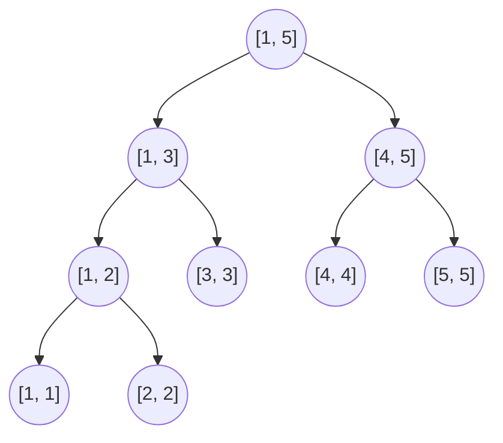
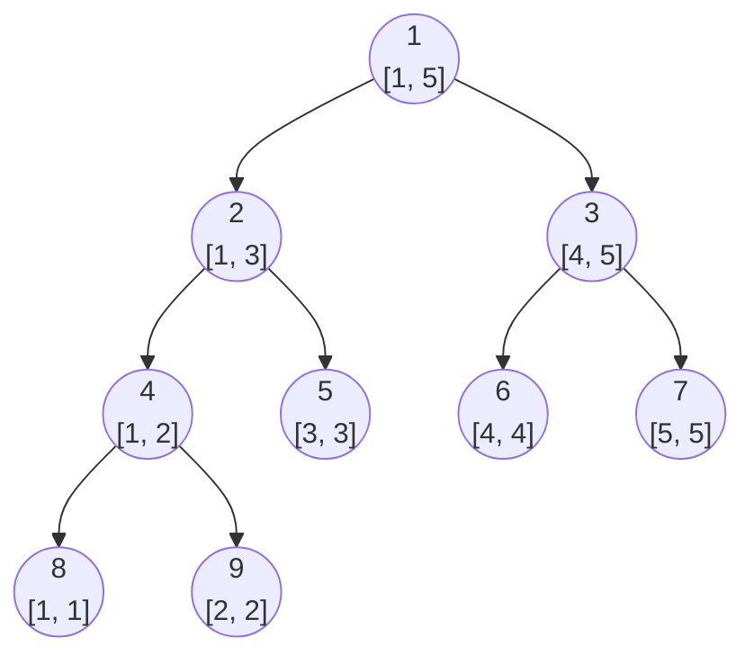
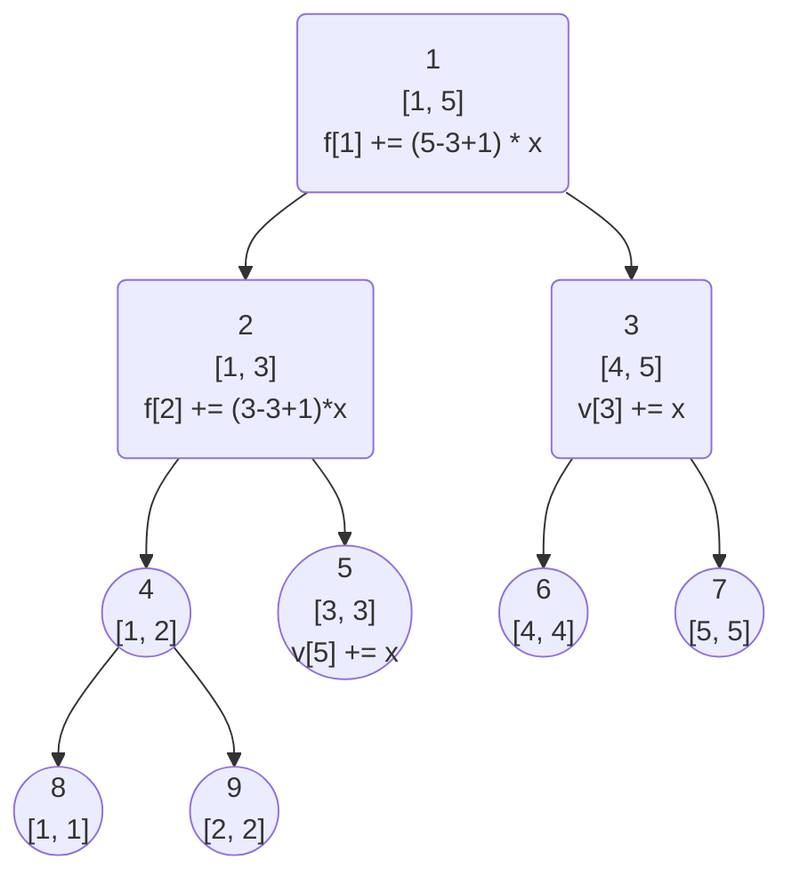
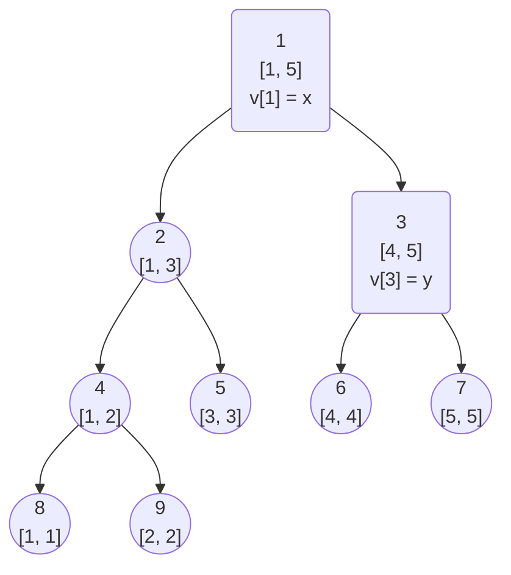

## 线段树简介
线段树常用来解决多次区间修改以及区间性质查询的问题， 且区间的性质一般可以由子区间推出， 如最大值、区间和。

## 线段树的结构
线段树顾名思义显然是一棵树， 且一般实现为二叉树。
线段树满足：

- 树上每一个结点都代表着一段区间

- 每个结点的两个子结点分别代表该区间的左右子区间。

<!--more-->

如区间[1, 5]用线段树表示为



显然， 线段树具有搜索树的性质。

## 基本建树

### 线段树的存储

线段树常用存储完全二叉树的方式、数组形式存储， 即根结点下标为1， 对于结点i， 它的左儿子下标为`2 * i`， 右儿子下标为`2 * i + 1`。

下面以图的形式展示各结点下标关系



至于数组的大小， 一般开到区间长度的四倍， 因为结点个数最多不会操过区间长度的四倍， 可自行证明。


### 代码实现

假设区间性质为区间和

```c++
const int N = xxx;
int a[N];//原数组
int f[N << 2];//存储线段树结点的某性质

void bulid (int k, int l, int r) {
    if (l == r) {
        f[k] = a[i];
        return;
    }
	 int m = l + r >> 1;
	 build(2 * k, l, m), bulid(2 * k + 1, m + 1, r);
    f[k] = f[2 * k] + f[2 * k + 1];//由子区间推出当前区间
}
```

## 线段树的单点修改及查询

### 例题 - [洛谷P3374](https://www.luogu.com.cn/problem/P3374)

>#### 题目描述
>
>如题，已知一个数列，你需要进行下面两种操作：
>
>- 将某一个数加上 x*
>- 求出某区间每一个数的和
>
>#### 输入格式
>
>第一行包含两个正整数 n*,*m*，分别表示该数列数字的个数和操作的总个数。
>
>第二行包含 *n* 个用空格分隔的整数，其中第 *i* 个数字表示数列第 i*i* 项的初始值。
>
>接下来 *m* 行每行包含 33 个整数，表示一个操作，具体如下：
>
>- `1 x k` 含义：将第 x*x* 个数加上 *k*
>- `2 x y` 含义：输出区间 [x,y][*x*,*y*] 内每个数的和
>
>#### 输出格式
>
>输出包含若干行整数，即为所有操作 2 的结果。
>
>#### 输入输出样例
>
>**输入 #1**
>
>```
>5 5
>1 5 4 2 3
>1 1 3
>2 2 5
>1 3 -1
>1 4 2
>2 1 4
>```
>
>**输出 #1**
>
>```
>14
>16
>```
>
>#### 说明/提示
>
>【数据范围】
>
>$1 \leq n, m \leq 10^5$

### 单点修改

在区间和线段树已经构建完成的情况下， 此时若要将某元素的值增大，则会有多个区间的和发生变化。

因此可以对线段树进行一次搜索， 将所有包含被修改元素的区间的区间和增大。

```c++
//k, l, r表示当前区间的下标及边界， x、y为被修改的元素下标和增大的值
void modify (int k, int l, int r, int s, int v) {
    f[k] += v;
    if (l == r) {
        return;
    }
    int m = l + r >> 1;
    if (s <= m) {//x在左半边
        modify(2 * k, l, m, s, v);
    } else {//x在右半边
        modify(2 * k + 1, m + 1, s, v);
    }
}
```

显然单点修改线段树的时间复杂度与树高有关， 为$O（log n)$


### 区间查询

由于区间和是可以由子区间推出的， 所以要求出[b, e]区间的区间和， 就要把[b, e]区间分解为若干个线段树上存在的区间。

如


若要查询[3, 5], 则应该分解为[3, 3] + [4, 5]

```c++
int query (int k, int l, int r, int b, int e) {
    if (l == b && r == e) {
        return f[k];
    }
    int m = l + r >> 1;
    if (e <= m) {//[b, e]完全在左区间
        return query(2 * k, l, m, b, e);
    } else if (b > m) {//完全在右区间
        return query(2 * k + 1, m + 1, b, e);
    } else {//[b, e]在左右区间均有分布
        return query(2 * k, l, m, b, m) + query(2 * k + 1, m + 1, r, b, e);
    }
}
```

查询时， 最坏情况下最遍历到最底层, 且支数是有限的， 时间复杂度为$O(log n)$


### 完整代码

```cpp
//
// Created by trudbot.
//

#include <bits/stdc++.h>
using namespace std;
const int N = 5e5;
int a[N], f[N << 2];
int n, m;

void build(int k, int l, int r) {
	if(l == r) {
		f[k] = a[l];
		return;
	}
	int m = l + r >> 1;
	build(2 * k, l, m);
	build(2  *k + 1, m + 1, r);
	f[k] = f[2 * k] + f[2 * k + 1];
}

void modify(int k, int l, int r, int s, int v) {
	f[k] += v;
	if(l == r) {
		return;
	}
	int m = l + r >> 1;
	if(s <= m) {
		modify(2 * k, l, m, s, v);
	} else {
		modify(2 * k + 1, m + 1, r, s, v);
	}
}

int query(int k, int l, int r, int b, int e) {
	if(l == b && r == e) {
		return f[k];
	}
	int m = l + r >> 1;
	if(e <= m) {
		return query(2 * k, l, m, b, e);
	} else if(b > m) {
		return query(2 * k + 1, m + 1, r, b, e);
	} else {
		return query(2 * k, l, m, b, m) + query(2 * k + 1, m + 1, r, m + 1, e);
	}
}

int main() {
	cin >> n >> m;
	for(int i=1; i<=n; i++) {
		cin >> a[i];
	}
	build(1, 1, n);
	
	while(m --) {
		int x, a, b; cin >> x >> a >> b;
		if(x == 1) {
			modify(1, 1, n, a, b);
		} else {
			cout << query(1, 1, n, a, b) << endl;
		}
	}
	return 0;
}
```


## 线段树的区间修改及查询

### 例题

> #### 【模板】线段树 1
>
> #### 题目描述
>
> 如题，已知一个数列，你需要进行下面两种操作：
>
> 1. 将某区间每一个数加上 $k$。
> 2. 求出某区间每一个数的和。
>
> #### 输入格式
>
> 第一行包含两个整数 $n, m$，分别表示该数列数字的个数和操作的总个数。
>
> 第二行包含 $n$ 个用空格分隔的整数，其中第 $i$ 个数字表示数列第 $i$ 项的初始值。
>
> 接下来 $m$ 行每行包含 $3$ 或 $4$ 个整数，表示一个操作，具体如下：
>
> 1. `1 x y k`：将区间 $[x, y]$ 内每个数加上 $k$。
> 2. `2 x y`：输出区间 $[x, y]$ 内每个数的和。
>
> #### 输出格式
>
> 输出包含若干行整数，即为所有操作 2 的结果。
>
> #### 样例 #1
>
> ##### 样例输入 #1
>
> ```
> 5 5
> 1 5 4 2 3
> 2 2 4
> 1 2 3 2
> 2 3 4
> 1 1 5 1
> 2 1 4
> ```
>
> ##### 样例输出 #1
>
> ```
> 11
> 8
> 20
> ```
>
> #### 提示
>
> 对于 $30\%$ 的数据：$n \le 8$，$m \le 10$。  
> 对于 $70\%$ 的数据：$n \le {10}^3$，$m \le {10}^4$。  
> 对于 $100\%$ 的数据：$1 \le n, m \le {10}^5$。
>
> 保证任意时刻数列中所有元素的绝对值之和 $\le {10}^{18}$。
>
> **【样例解释】**
>
> 


### 区间修改与永久懒惰标记

这次要求将区间所有元素都加上某个数， 直接遍历加上再重新建树肯定不行， 这样时间复杂度会来到$O(n)$；更加不能对区间每一个元素都进行单点修改， 否则时间复杂度为$O(n log n)$。

这时我们需要用一个懒惰标记的手段， 对于修改的区间[b, e]， 我们把它分解为线段树上若干的区间， 对这些区间增加一个“标记”， 即标记增加了x。而对分解区间的父区间， 则是直接修改f值。

如下图， 假设为在[3, 5]区间加上x， 且用v[N<<2]来记录某结点区间加的值。



```c++
void modify (int k, int l, int r, int b, int e, int x) {
    if (b == l && e == r) {
        v[k] += x;
        return;
    }
    f[k] += (e - b + 1) * x;
    int m = l + r >> 1;
    if (e <= m) {
        modify(2 * k, l, m, b, e, x);
    } else if (b > m) {
        modify(2 * k + 1, m+1, r, b, e, x);
    } else {
        modify(2 * k, l, m, b, m, x);
        modify(2 * k + 1, m + 1, r, m + 1, e, x);
    }
}
```


### 区间查询

v[i] += x表示在对i号结点区间[l, r]上的每个元素都加上了x， 所有包含[l, r]的大区间也都已经都记录了变化； 但如果我们要查询的是[l, r]的子区间呢？

这时对懒惰标记的处理就至关重要了， 在向下遍历线段树的途中用一个变量来记录沿途的标记， 最后在加到被查询区间上。

如



此时v[1]和v[3]上均有标记， 若我们要查询[4, 4]的区间和， 在搜索改区间的过程上会记录路径上的所有标记的和， 所以结果应该为`f[6] + (x + y) * (4 - 4 + 1)`

```c++

ll query(int k, int l, int r, int b, int e, int p) {
    p += v[k];
    if(l == b && r == e) {
        return p * (r - l + 1) + f[k];
    }
    int m = l + r >> 1;
    if (e <= m) {
        return query(2 * k, l, m, b, e, p);
    } else if (b > m) {
        return query(2 * k + 1, m + 1, r, b, e, p);
    } else {
        return query(2 * k, l, m, b, m, p) + query(2 * k + 1, m + 1, r, m + 1, e, p);
    }
}
```

 

### 完整代码

```cpp
#include <bits/stdc++.h>
using namespace std;
using ll = long long;
const int N = 1e5 + 10;
ll a[N], f[N<<2], v[N<<2];

void build(int k, int l, int r) {
	if(l == r) {
		f[k] = a[l];
		return;
	}
	int m = l + r >> 1;
	build(2 * k, l, m), build(2 * k + 1, m + 1, r);
	f[k] = f[2 * k] + f[2 * k + 1];
}

void modify(int k, int l, int r, int x, int y, int z) {
	if(l == x && r == y) {
		v[k] += z;
		return;
	}
	f[k] += (y - x + 1) * z;
	int m = l + r >> 1;
	if(y <= m) {
		modify(k * 2, l, m, x, y, z);
	} else if(x > m) {
		modify(k * 2 + 1, m + 1, r, x, y, z);
	} else {
		modify(2 * k, l, m, x, m, z);
		modify(2 * k + 1, m + 1, r, m + 1, y, z);
	}
}

ll query(int k, int l, int r, int x, int y, ll p) {
	p += v[k];
	if(l == x && r == y) {
		return p * (r - l + 1) + f[k];
	}
	int m = l + r >> 1;
	if(y <= m) {
		return query(2 * k, l, m, x, y, p);
	} else if(x > m) {
		return query(2 * k + 1, m + 1, r, x, y, p);
	} else {
		return query(2 * k, l, m, x, m, p) 
			+ query(2 * k + 1, m + 1, r, m + 1, y, p);
	}
}

int main() {
	int n, m; cin >> n >> m;
	for(int i=1; i<=n; i++) {
		cin >> a[i];
	}
	build(1, 1, n);
	while (m --) {
		int t; cin >> t;
		if(t == 1) {
			int x, y; ll z; cin >> x >> y >> z;
			modify(1, 1, n, x, y, z);
		} else {
			int x, y;
			cin >> x >> y;
			cout << query(1, 1, n, x, y, 0) << endl;
		}
	}
	return 0;
}
```

### 标记下传与自下而上更新

在上述标记永久化方法中， 对标记的处理方法是：

* modify时的被标记区间的父区间不标记， 而是直接修改。
* query时， 会累加遍历路径中的标记， 最后作用于查询区间。

但使用标记永久化的很重要的一个条件是标记可以累加， 很多时候可以并不能满足。

而标记下传是适用性更广的一种标记处理方法， 有两个核心方法：

* pushdown， 把当前结点的标记下传
* pushup， 由子结点更新当前结点。

标记下传的基本规则是：

* 为某结点添加标记时， 会修改结点的值。
* 在遍历到线段树的某个结点时， 若还要往下遍历， 则把标记下传， 并在遍历完子树后更新当前结点。

标记下传是一种延迟修改的思想， 在修改[l, r]时如果直接把它的每一个子区间都修改， 显然在时间复杂度上是灾难。 但标记下传只在需要查询/修改子区间时把上一次的修改作用于子区间， 修改的过程融合在了查询/其它修改 的过程中。
```c++
#include <bits/stdc++.h>
using namespace std;
using ll = long long;
const int N = 1e5 + 10;
ll a[N], f[N << 2], v[N << 2];

void pushup(int k) {
    f[k] = f[2 * k] + f[2 * k + 1];
}

void pushdown(int k, int l, int r) {
    if (v[k]) {
        int left = 2 * k, right = left + 1, m = (l + r) >> 1;
        f[left] += v[k] * (m - l + 1), f[right] += v[k] * (r - m);
        v[left] += v[k], v[right] += v[k], v[k] = 0;
    }
}

void build(int k, int l, int r) {
    if(l == r) {
        f[k] = a[l];
        return;
    }
    int m = (l + r) >> 1;
    build(2 * k, l, m), build(2 * k + 1, m + 1, r);
    pushup(k);
}

void modify (int k, int l, int r, int b, int e, int s) {
    if(l == b && e == r) {
        f[k] += (r - l + 1) * s;
        v[k] += s;
        return;
    }
    pushdown(k, l, r);
    int m = (l + r) >> 1;
    if (e <= m) {
        modify(2 * k, l, m, b, e, s);
    } else if (b > m) {
        modify(2 * k + 1, m + 1, r, b, e, s);
    } else {
        modify(2 * k, l, m, b, m, s), modify(2 * k + 1, m + 1, r, m + 1, e, s);
    }
    pushup(k);
}

ll query(int k, int l, int r, int b, int e) {
    if (l == b && e == r) {
        return f[k];
    }
    pushdown(k, l, r);
    int m = (l + r) >> 1;
    ll res;
    if (e <= m) {
        res = query(2 * k, l, m, b, e);
    } else if (b > m ) {
        res = query(2 * k + 1, m + 1, r, b, e);
    } else {
        res = query(2 * k, l, m, b, m) + query(2 * k + 1, m + 1, r, m + 1, e);
    }
    pushup(k);
    return res;
}


int main () {
    int n, m; cin >> n >> m;
    for (int i = 1; i <= n; i++) {
        cin >> a[i];
    }
    build(1, 1, n);
    while (m --) {
        int t; cin >> t;
        if (t == 1) {
            int b, e, x; cin >> b >> e >> x;
            modify(1, 1, n, b, e, x);
        } else {
            int b, e; cin >> b >> e;
            cout << query(1, 1, n, b, e) << endl;
        }
    }
    return 0;
}
```

## 线段树实战

### 旅馆

[261. 旅馆 - AcWing题库](https://www.acwing.com/problem/content/description/263/)

> 一家旅馆共有 N 个房间，这 N 个房间是连成一排的，标号为 1∼N。
>
> 现在有很多旅客以组为单位前来入住，每组旅客的数量可以用 Di来表示。
>
> 旅店的业务分为两种，入住和退房：
>
> 1. 旅客入住时，第 i 组旅客需要根据他们的人数 D~i~，给他们安排 D~i~ 个连续的房间，并且房间号要尽可能的小。如果房间不够，则无法安排。
> 2. 旅客退房时，第 i 组旅客的账单将包含两个参数 X~i~ 和 D~i~，你需要将房间号 X~i~到 X~i~+D~i~−1之间的房间全部清空。
>
> 现在你需要帮助该旅馆处理 M 单业务。
>
> 旅馆最初是空的。
>
> #### 输入数据
>
> 第一行输入两个用空格隔开的整数 N 和 M。
>
> 接下来 M 行将描述 M 单业务：
>
> “1 D~i~”表示这单业务为入住业务。
>
> “2 X~i~ D~i~”表示这单业务为退房业务。
>
> #### 输出数据
>
> 每个入住业务输出一个整数，表示要安排的房间序列中的第一个房间的号码。
>
> 如果没办法安排，则输出 0。
>
> 每个输出占一行。
>
> #### 数据范围
>
> 1≤D~i~≤N≤50000
> 1≤M<50000
>
> #### 输入样例：
>
> ```
> 10 6
> 1 3
> 1 3
> 1 3
> 1 3
> 2 5 5
> 1 6
> ```
>
> #### 输出样例：
>
> ```
> 1
> 4
> 7
> 0
> 5
> ```

#### 题意解析
对于长度为N的01串（下标从1开始）， 需实现以下两种操作：
* 查询串中最靠左的长度为d的全0串， 并返回左端点（若不存在返回0）； 随后把这个全0串变成全1串。
* 把区间[x, x + d - 1]变成全0

#### 思路
设计线段树的结点保存区间的三种信息：
- 区间中的最长0串长度
- 区间中以左端点开始的最长0串长度
- 区间中以右端点结束的最长0串长度

这样设计的巧妙之处在于：
- 由两个子区间的信息可以推出当前区间的信息
- 通过三个信息可以递归查找出最左的长度为d的0串

#### 代码
```c++
#include <bits/stdc++.h>
using namespace std;
const int N = 50010;

struct node{
    int l, r;
    int m, lm, rm;
    int s;
} f[N << 2];

inline void allSet (int k, int v) {
    f[k].m = f[k].lm = f[k].rm = v;
}

inline void build (int k, int l, int r) {
    f[k].l = l, f[k].r = r, f[k].s = 0;
    allSet(k, r - l + 1);
    if (l == r) {
        return;
    }
    int m = l + r >> 1;
    build(2 * k, l, m), build(2 * k + 1, m + 1, r);
}

inline void pushdown (int k) {
    int left = 2 * k, right = left + 1;
    if (f[k].s == 1) {
        allSet(left, 0), allSet(right, 0);
    } else if (f[k].s == -1) {
        allSet(left, f[left].r - f[left].l + 1), 
        allSet(right, f[right].r - f[right].l + 1);
    } else {
        return;
    }
    f[left].s = f[right].s = f[k].s, f[k].s = 0;
}

void pushup (int k) {
    int left = 2 * k, right  = left + 1;
    f[k].m = max(f[left].m, max(f[right].m, f[left].rm + f[right].lm));
    f[k].lm = f[left].lm;
    if (f[left].lm == f[left].r - f[left].l + 1) {
       f[k].lm += f[right].lm; 
    }
    f[k].rm = f[right].rm;
    if (f[right].rm == f[right].r - f[right].l + 1) {
        f[k].rm += f[left].rm;
    }
}

int query (int k, int len) {
    if (f[k].m < len) {
        return 0;
    }
    pushdown(k);
    if (f[k].lm >= len) {
        return f[k].l;
    } else if (f[2 * k].m >= len) {
        return query(2 * k, len);
    } else if (f[2 * k].rm + f[2 * k + 1].lm >= len) {
        return f[2 * k].r - f[2 * k].rm + 1;
    } else {
        return query(2 * k + 1, len);
    }
}

void modify (int k, int l, int r, int s) {
    if (f[k].l == l && f[k].r == r) {
        if (s == 1) {
            allSet(k, 0);
        } else {
            allSet(k, f[k].r - f[k].l + 1);
        }
        f[k].s = s;
        return;
    }
    pushdown(k);
    int m = f[k].l + f[k].r >> 1;
    if (r <= m) {
        modify(2 * k, l, r, s);
    } else if (l > m) {
        modify(2 * k + 1, l, r, s);
    } else {
        modify(2 * k, l, m, s), modify(2 * k + 1, m + 1, r, s);
    }
    pushup(k);
}


int main () {
    int n, m; cin >> n >> m;
    build(1, 1, n);
    while (m --) {
        int t; cin >> t;
        if (t == 1) {
            int d; cin >> d;
            int b = query(1, d);
            cout << b << endl; 
            if (b != 0) {
                modify(1, b, b + d - 1, 1);
            }
        } else {
            int x, d; cin >> x >> d;
            modify(1, x, x + d -1, -1);
        }
    }
    return 0;
}
```

### 最长递增子序列

> 给你一个整数数组 nums 和一个整数 k 。
>
> 找到 nums 中满足以下要求的最长子序列：
>
> 子序列 严格递增
> 子序列中相邻元素的差值 不超过 k 。
> 请你返回满足上述要求的 最长子序列 的长度。
>
> 子序列 是从一个数组中删除部分元素后，剩余元素不改变顺序得到的数组。
>
> 示例 1：
>
> 输入：nums = [4,2,1,4,3,4,5,8,15], k = 3
> 输出：5
> 解释：
> 满足要求的最长子序列是 [1,3,4,5,8] 。
> 子序列长度为 5 ，所以我们返回 5 。
> 注意子序列 [1,3,4,5,8,15] 不满足要求，因为 15 - 8 = 7 大于 3 。
> 示例 2：
>
> 输入：nums = [7,4,5,1,8,12,4,7], k = 5
> 输出：4
> 解释：
> 满足要求的最长子序列是 [4,5,8,12] 。
> 子序列长度为 4 ，所以我们返回 4 。
> 示例 3：
>
> 输入：nums = [1,5], k = 1
> 输出：1
> 解释：
> 满足要求的最长子序列是 [1] 。
> 子序列长度为 1 ，所以我们返回 1 。
>
>
> 提示：
>
> 1 <= nums.length <= 10^5^
> 1 <= nums[i], k <= 10^5^
>
> 来源：力扣（LeetCode）
> 链接：https://leetcode.cn/problems/longest-increasing-subsequence-ii
> 著作权归领扣网络所有。商业转载请联系官方授权，非商业转载请注明出处。

#### 思路分析
可以注意到数组的元素值是有范围的， 位于[1, 1e5]。

定义a[j]为在数组nums中[0, i]以j结尾的满足题意的最长递增序列长度； 则当考虑nums[i + 1]是， 只需要把nums[i + 1]加到某个序列的末尾， 此序列的最后一个元素x应该满足：x < nums[i + 1] , x >= nums[i + 1] - k.

可以得到x的范围为[nums[i + 1] - k, nums[i + 1] - 1]， 在此区间查找最长的子序列长度， 在更新a[nums[i + 1]]即可。

查询某区间的最大值， 显然可以使用线段树。

#### 代码参考
时间复杂度：$O(n\log_2x)$
```c++
const int N = 1e5 + 10;
int f[N << 2];

void modify (int u, int l, int r, int x, int v) {
    if (l == r) {
        f[u] = max(f[u], v);
        return;
    }
    int m = (l + r) >> 1;
    if (x <= m) {
        modify(2 * u, l, m, x, v);
    } else {
        modify(2 * u + 1, m + 1, r, x, v);
    }
    f[u] = max(f[2 * u], f[2 * u + 1]);
}

int query (int u, int l, int r , int b, int e) {
    if (l == b && r == e) {
        return f[u];
    }
    int m = (l + r) >> 1;
    if (e <= m) {
        return query(2 * u, l, m, b, e);
    } else if (b > m) {
        return query(2 * u + 1, m + 1, r, b, e);
    } else {
        return max(query(2 * u, l, m, b, m),
            query(2 * u + 1, m + 1, r, m + 1, e));
    }
}

class Solution {
public:
    int lengthOfLIS(vector<int>& nums, int k) {
        memset(f, 0, sizeof f);
        int mx = 0;
        for (auto i : nums) {
            mx = max(i, mx);
        }
        for (auto i : nums) {
            int t;
            if (i == 1) {//特判1, 因为比1小的数不在线段树区间范围内
                t = 0;
            } else {
                t = query(1, 1, mx, max(1, i - k), i - 1);
            }
            modify(1, 1, mx, i, t + 1);
        }
        return f[1];
    }
};
```

